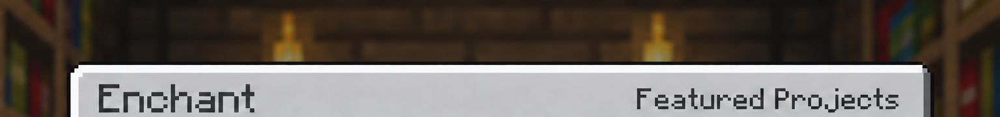
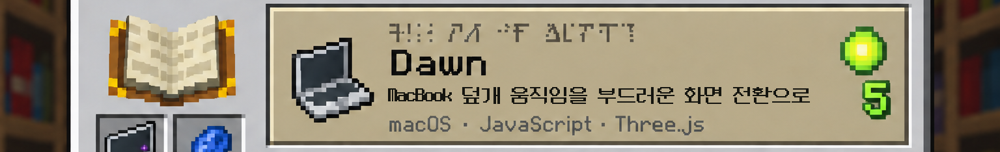
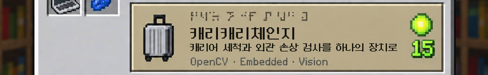
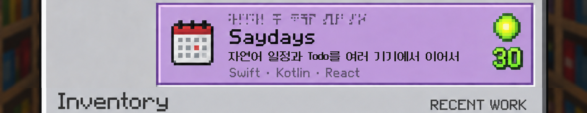
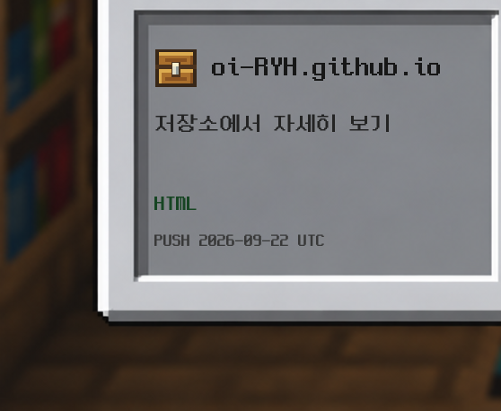
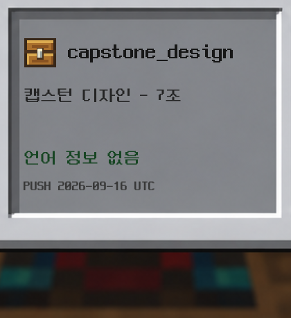
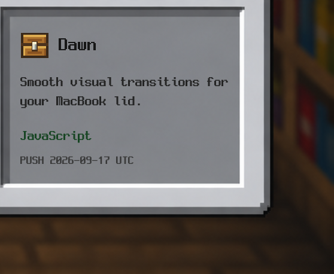
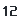

  

  

  

<h2 align="center"> <picture></picture></h2>

   <picture></picture>
   <picture></picture>
  

<picture></picture>

<!-- RECENT_REPOS:START -->

<!-- RECENT_REPOS:END -->

<h2 align="center"> <picture></picture></h2>

<picture></picture>

 <strong><picture></picture></strong>

  
  
  
  
  
  

 <strong><picture></picture></strong>

<picture></picture>

 <strong><picture></picture></strong>

<picture></picture>

<h2 align="center"> <picture></picture></h2>

<picture></picture>

<!-- MINE_MODE:START -->

<picture></picture>

<!-- MINE_MODE:END -->

<!-- MINE_GRID:START -->

 
 

<!-- MINE_GRID:END -->

<!-- MINE_STATS:START -->

<strong><picture></picture></strong> <picture></picture>

<table align="center">
<thead><tr><th align="center"><picture></picture></th><th align="center"><picture></picture></th><th align="center"><picture></picture></th></tr></thead>
<tbody>
<tr><td align="center"></td><td align="center"><picture></picture></td><td align="center"><picture></picture></td></tr>
<tr><td align="center"></td><td align="center"><picture></picture></td><td align="center"><picture></picture></td></tr>
<tr><td align="center"></td><td align="center"><picture></picture></td><td align="center"><picture></picture></td></tr>
<tr><td align="center"></td><td align="center"><picture></picture></td><td align="center"><picture></picture></td></tr>
</tbody>
</table>

<strong><picture></picture></strong> 
 <picture></picture> 
 <picture></picture> 
 <picture></picture> 
 <picture></picture> 
 <picture></picture> 

<!-- MINE_STATS:END -->

<picture></picture>

<picture></picture> 
<picture></picture>

<table align="center">
<thead><tr><th align="center"><picture></picture></th><th align="center"><picture></picture></th></tr></thead>
<tbody>
<tr><td align="center"><picture></picture></td><td align="center"><picture></picture></td></tr>
<tr><td align="center"><picture></picture></td><td align="center"><picture></picture></td></tr>
<tr><td align="center"><picture></picture></td><td align="center"><picture></picture></td></tr>
</tbody>
</table>

<picture></picture>

<h2 align="center"> <picture></picture></h2>

<table align="center"><tr>
<td align="center"><a href="https://oi-ryh.github.io"> </a></td>
<td align="center"><a href="https://github.com/oi-RYH?tab=repositories"> </a></td>
</tr></table>

 <strong><picture></picture></strong>

<picture>
  
</picture>

 <strong><picture></picture></strong>

