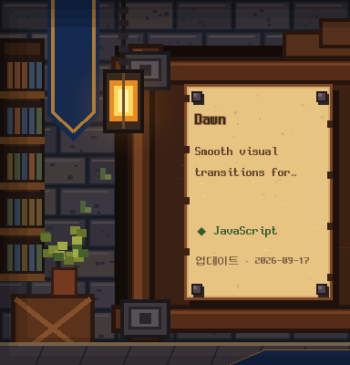
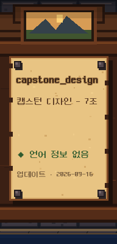
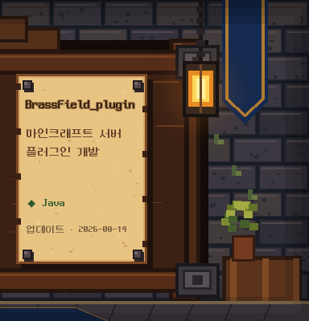
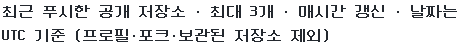
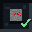
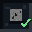
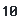

  

# <picture></picture>

<picture></picture>

|  |  |  |  |
| :---: | :---: | :---: | :---: |
| <picture></picture> | <picture></picture> | <picture></picture> | <picture></picture> |

##  <picture></picture>

<!-- RECENT_REPOS:START -->

<picture></picture>
<!-- RECENT_REPOS:END -->

##  <picture></picture>

 <strong><picture></picture></strong>

  
  
  
  
  
  

 <strong><picture></picture></strong>

<picture></picture>

 <strong><picture></picture></strong>

<picture></picture>

##  <picture></picture>

<picture></picture>

<!-- MINE_MODE:START -->
<picture></picture>
<!-- MINE_MODE:END -->

<!-- MINE_GRID:START -->
| <picture></picture> | <picture></picture> | <picture></picture> | <picture></picture> | <picture></picture> | <picture></picture> |
|:---:|:---:|:---:|:---:|:---:|:---:|
|  <picture></picture> <picture></picture> |  <picture></picture> <picture></picture> |  |  |  |  <picture></picture> <picture></picture> |
|  |  |  |  <picture></picture> <picture></picture> |  |  |
|  |  <picture></picture> <picture></picture> |  |  |  |  |
<!-- MINE_GRID:END -->

<!-- MINE_STATS:START -->
<picture></picture>

| <picture></picture> | <picture></picture> | <picture></picture> |
| :--- | ---: | ---: |
|  | <picture></picture> | <picture></picture> |
|  | <picture></picture> | <picture></picture> |

<picture></picture>

-  <picture></picture>
-  <picture></picture>
-  <picture></picture>
-  <picture></picture>
-  <picture></picture>
<!-- MINE_STATS:END -->

<picture></picture>

<picture></picture>
<picture></picture>

| <picture></picture> | <picture></picture> |
| :--- | ---: |
| <picture></picture> | <picture></picture> |
| <picture></picture> | <picture></picture> |
| <picture></picture> | <picture></picture> |

<picture></picture>

##  <picture></picture>

| [ ](https://oi-ryh.github.io) | [ ](https://github.com/oi-RYH?tab=repositories) |
| :---: | :---: |

 <strong><picture></picture></strong>

<picture>
  
</picture>

 <strong><picture></picture></strong>

