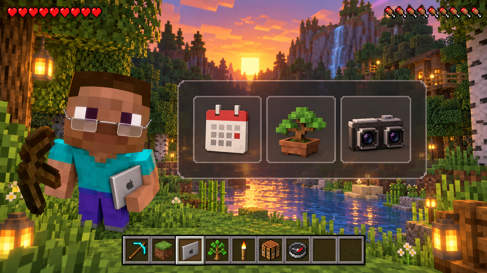

  

<h1 align="center">RYH's inventory</h1>

  작은 도구와 느긋한 게임을 만듭니다. 
  Building small tools, playful interfaces, and experiments with pixels, sound, and light.

  <a href="https://oi-ryh.github.io">Field notes</a>
  ·
  <a href="https://github.com/oi-RYH?tab=repositories">All repositories</a>

---

## Currently crafting

| Slot | Project | What it is | Main tools |
| :---: | --- | --- | --- |
| 📅 | **[Say Days](https://github.com/oi-RYH/11.03_colloquial-calendar)** | 일상을 자연스러운 말로 기록하는 캘린더 | TypeScript · Cloudflare Workers |
| 🌱 | **bonsai** | 천천히 자라는 작은 iOS 게임 실험 | Swift · SpriteKit |
| 📷 | **[Stereo camera](https://github.com/oi-RYH/capstone_design)** | 두 카메라의 시선을 맞추는 캘리브레이션 도구 | C++ · C# · OpenCV |

## Inventory

  
  
  
  
  
  

  
<strong>Player stats</strong>

   
  

    
    
  

  
<strong>World activity</strong>

   
  <picture>
    <source media="(prefers-color-scheme: dark)" srcset="https://raw.githubusercontent.com/oi-RYH/oi-RYH/output/github-snake-dark.svg" />
    
  </picture>

  build small · play slowly

