

  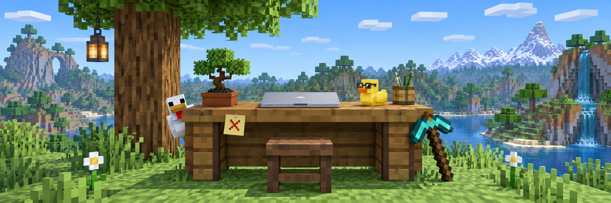

  

  <a href="#crafting">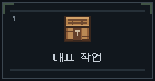</a><a href="#inventory">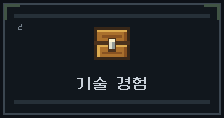</a><a href="#community-mine">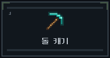</a><a href="#field-notes">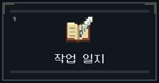</a>

<h2 align="center"> <picture></picture></h2>

<strong><picture></picture></strong> 
<picture>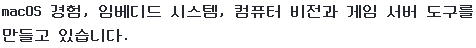</picture>

   <picture></picture>
   <picture></picture>
  

<table align="center">
<tr>
<td align="center" valign="top" width="33%">

<h3><picture>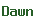</picture></h3>

<strong><picture>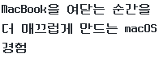</picture></strong>

<picture>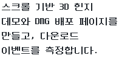</picture>

<code><picture>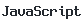</picture></code> <code><picture>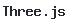</picture></code> <code><picture></picture></code>

<strong><picture></picture></strong> <picture>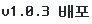</picture>

 <picture></picture> 

</td>
<td align="center" valign="top" width="34%">

<h3><picture>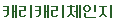</picture></h3>

<strong><picture>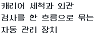</picture></strong>

<picture>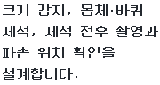</picture>

<code><picture></picture></code> <code><picture></picture></code> <code><picture></picture></code>

<strong><picture></picture></strong> <picture></picture>

</td>
<td align="center" valign="top" width="33%">

<h3><picture>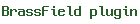</picture></h3>

<strong><picture>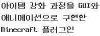</picture></strong>

<picture>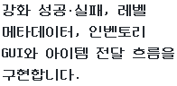</picture>

<code><picture>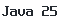</picture></code> <code><picture>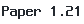</picture></code> <code><picture>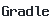</picture></code>

<strong><picture></picture></strong> <picture></picture>

</td>
</tr>
</table>

<h2 align="center">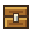 <picture></picture></h2>

<picture>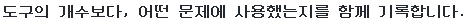</picture>

<table align="center">
<thead>
<tr><th align="center"><picture></picture></th><th align="center"><picture></picture></th><th align="center"><picture></picture></th></tr>
</thead>
<tbody>
<tr><td align="center"><strong><picture></picture></strong></td><td align="center"><picture>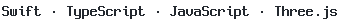</picture></td><td align="center"><picture></picture></td></tr>
<tr><td align="center"><strong><picture></picture></strong></td><td align="center"><picture>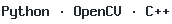</picture></td><td align="center"><picture></picture></td></tr>
<tr><td align="center"><strong><picture></picture></strong></td><td align="center"><picture>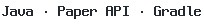</picture></td><td align="center"><picture></picture></td></tr>
</tbody>
</table>

 <strong><picture></picture></strong>

  
  
  
  
  
  

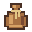 <strong><picture></picture></strong>

<picture></picture>

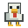 <strong><picture></picture></strong>

<picture></picture>

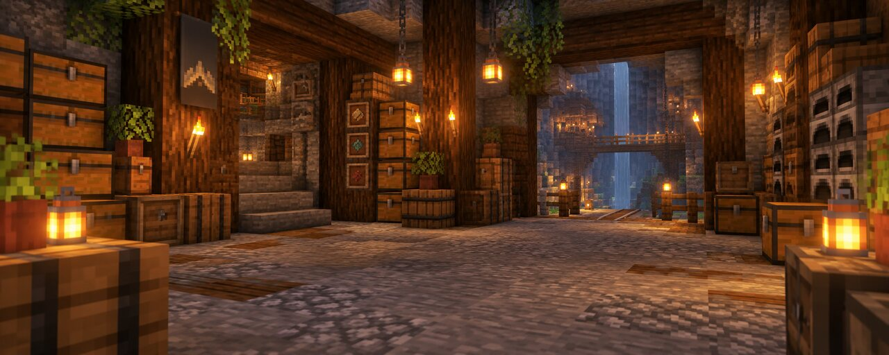

<h2 align="center">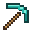 <picture>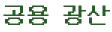</picture></h2>

<picture></picture>

<!-- MINE_MODE:START -->

<picture>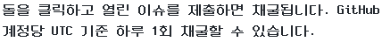</picture>

<!-- MINE_MODE:END -->

<!-- MINE_GRID:START -->

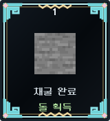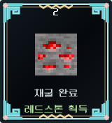<a href="https://github.com/oi-RYH/oi-RYH/issues/new?title=mine%7C1%7C2%7C0&body=%EC%A0%9C%EB%AA%A9%EC%9D%84+%EA%B7%B8%EB%8C%80%EB%A1%9C+%EB%91%90%EA%B3%A0+%EC%9D%B4%EC%8A%88%EB%A5%BC+%EC%A0%9C%EC%B6%9C%ED%95%98%EB%A9%B4+%EC%9D%B4+%EB%B8%94%EB%A1%9D%EC%9D%84+%EC%B1%84%EA%B5%B4%ED%95%A9%EB%8B%88%EB%8B%A4.">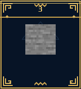</a><a href="https://github.com/oi-RYH/oi-RYH/issues/new?title=mine%7C1%7C3%7C0&body=%EC%A0%9C%EB%AA%A9%EC%9D%84+%EA%B7%B8%EB%8C%80%EB%A1%9C+%EB%91%90%EA%B3%A0+%EC%9D%B4%EC%8A%88%EB%A5%BC+%EC%A0%9C%EC%B6%9C%ED%95%98%EB%A9%B4+%EC%9D%B4+%EB%B8%94%EB%A1%9D%EC%9D%84+%EC%B1%84%EA%B5%B4%ED%95%A9%EB%8B%88%EB%8B%A4.">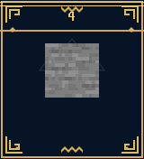</a><a href="https://github.com/oi-RYH/oi-RYH/issues/new?title=mine%7C1%7C4%7C0&body=%EC%A0%9C%EB%AA%A9%EC%9D%84+%EA%B7%B8%EB%8C%80%EB%A1%9C+%EB%91%90%EA%B3%A0+%EC%9D%B4%EC%8A%88%EB%A5%BC+%EC%A0%9C%EC%B6%9C%ED%95%98%EB%A9%B4+%EC%9D%B4+%EB%B8%94%EB%A1%9D%EC%9D%84+%EC%B1%84%EA%B5%B4%ED%95%A9%EB%8B%88%EB%8B%A4.">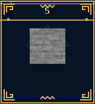</a>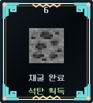 
<a href="https://github.com/oi-RYH/oi-RYH/issues/new?title=mine%7C1%7C0%7C1&body=%EC%A0%9C%EB%AA%A9%EC%9D%84+%EA%B7%B8%EB%8C%80%EB%A1%9C+%EB%91%90%EA%B3%A0+%EC%9D%B4%EC%8A%88%EB%A5%BC+%EC%A0%9C%EC%B6%9C%ED%95%98%EB%A9%B4+%EC%9D%B4+%EB%B8%94%EB%A1%9D%EC%9D%84+%EC%B1%84%EA%B5%B4%ED%95%A9%EB%8B%88%EB%8B%A4.">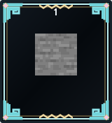</a><a href="https://github.com/oi-RYH/oi-RYH/issues/new?title=mine%7C1%7C1%7C1&body=%EC%A0%9C%EB%AA%A9%EC%9D%84+%EA%B7%B8%EB%8C%80%EB%A1%9C+%EB%91%90%EA%B3%A0+%EC%9D%B4%EC%8A%88%EB%A5%BC+%EC%A0%9C%EC%B6%9C%ED%95%98%EB%A9%B4+%EC%9D%B4+%EB%B8%94%EB%A1%9D%EC%9D%84+%EC%B1%84%EA%B5%B4%ED%95%A9%EB%8B%88%EB%8B%A4.">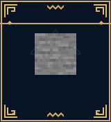</a><a href="https://github.com/oi-RYH/oi-RYH/issues/new?title=mine%7C1%7C2%7C1&body=%EC%A0%9C%EB%AA%A9%EC%9D%84+%EA%B7%B8%EB%8C%80%EB%A1%9C+%EB%91%90%EA%B3%A0+%EC%9D%B4%EC%8A%88%EB%A5%BC+%EC%A0%9C%EC%B6%9C%ED%95%98%EB%A9%B4+%EC%9D%B4+%EB%B8%94%EB%A1%9D%EC%9D%84+%EC%B1%84%EA%B5%B4%ED%95%A9%EB%8B%88%EB%8B%A4.">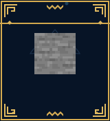</a>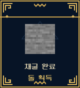<a href="https://github.com/oi-RYH/oi-RYH/issues/new?title=mine%7C1%7C5%7C1&body=%EC%A0%9C%EB%AA%A9%EC%9D%84+%EA%B7%B8%EB%8C%80%EB%A1%9C+%EB%91%90%EA%B3%A0+%EC%9D%B4%EC%8A%88%EB%A5%BC+%EC%A0%9C%EC%B6%9C%ED%95%98%EB%A9%B4+%EC%9D%B4+%EB%B8%94%EB%A1%9D%EC%9D%84+%EC%B1%84%EA%B5%B4%ED%95%A9%EB%8B%88%EB%8B%A4.">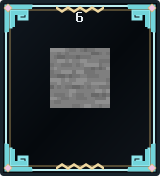</a> 

<!-- MINE_GRID:END -->

<!-- MINE_STATS:START -->

<strong><picture></picture></strong> <picture></picture>

<table align="center">
<thead><tr><th align="center"><picture></picture></th><th align="center"><picture></picture></th><th align="center"><picture></picture></th></tr></thead>
<tbody>
<tr><td align="center"><a href="https://github.com/oi-RYH">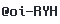</a></td><td align="center"><picture></picture></td><td align="center"><picture>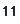</picture></td></tr>
<tr><td align="center"><a href="https://github.com/songkh1201">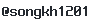</a></td><td align="center"><picture></picture></td><td align="center"><picture></picture></td></tr>
</tbody>
</table>

<strong><picture>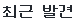</picture></strong> 
 <picture></picture> 
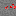 <picture></picture> 
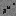 <picture></picture> 
 <picture></picture> 
 <picture></picture> 

<!-- MINE_STATS:END -->

<picture></picture>

<picture>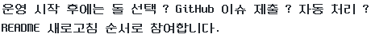</picture> 
<picture>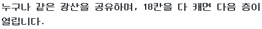</picture>

<table align="center">
<thead><tr><th align="center"><picture></picture></th><th align="center"><picture></picture></th></tr></thead>
<tbody>
<tr><td align="center"><picture></picture></td><td align="center"><picture>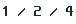</picture></td></tr>
<tr><td align="center"><picture></picture></td><td align="center"><picture>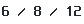</picture></td></tr>
<tr><td align="center"><picture></picture></td><td align="center"><picture>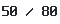</picture></td></tr>
</tbody>
</table>

<picture>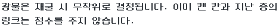</picture>

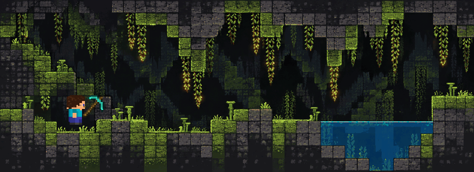

<h2 align="center"> <picture>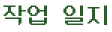</picture></h2>

<table align="center"><tr>
<td align="center"><a href="https://oi-ryh.github.io"> </a></td>
<td align="center"><a href="https://github.com/oi-RYH?tab=repositories"> </a></td>
</tr></table>

 <strong><picture></picture></strong>

<picture>
  
</picture>

 <strong><picture></picture></strong>

