

  

# 

|  |  |  |  |
| :---: | :---: | :---: | :---: |
|  |  |  |  |

##  

<!-- RECENT_REPOS:START -->
<table>
  <tr>
    <td width="33%" valign="top">
      <h3> </h3>
      

      
 

      
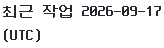

    </td>
    <td width="33%" valign="top">
      <h3> <a href="https://github.com/oi-RYH/capstone_design">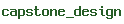</a></h3>
      

      
 

      
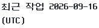

    </td>
    <td width="33%" valign="top">
      <h3> <a href="https://github.com/oi-RYH/BrassField_plugin">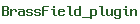</a></h3>
      

      
 

      
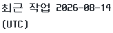

    </td>
  </tr>
</table>

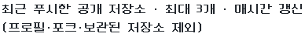
<!-- RECENT_REPOS:END -->

##  

 <strong></strong>

  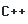
  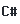
  
  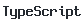
  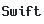
  

 <strong></strong>

 <strong></strong>

##  

<!-- MINE_MODE:START -->
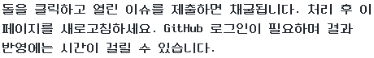
<!-- MINE_MODE:END -->

<!-- MINE_GRID:START -->
|  |  |  |  |  |  |
|:---:|:---:|:---:|:---:|:---:|:---:|
|    |  |  |  |  |  |
|  |  |  |  |  |  |
|  |  |  |  |  |  |
<!-- MINE_GRID:END -->

<!-- MINE_STATS:START -->

|  |  |  |
| :--- | ---: | ---: |
|  |  |  |

-  
<!-- MINE_STATS:END -->

|  |  |
| :--- | ---: |
|  |  |
|  |  |
|  |  |

##  

  

  
<strong></strong>

   
  

    
    
  

  
<strong></strong>

   
  <picture>
    <source media="(prefers-color-scheme: dark)" srcset="https://raw.githubusercontent.com/oi-RYH/oi-RYH/output/github-snake-dark.svg" />
    
  </picture>

