<!-- ⚡ Animated pixel banner (커스텀 제작) -->
<p align="center">
  
</p>

<!-- ⌨️ 타이핑 인트로 -->
<p align="center">
  <a href="https://oi-ryh.github.io">
    
  </a>
</p>

<p align="center">
  <a href="https://oi-ryh.github.io"></a>
  
</p>

---

## 🕹️ About me

```text
┌──────────────────────────────────────────────┐
│  > whoami                                    │
│  developer who loves pixels, sound & light   │
│                                              │
│  > current_quest                             │
│  ▸ 📷 stereo camera calibration (C++/C#)     │
│  ▸ ☁️ Say Days — retro calendar web app      │
│  ▸ 🌱 bonsai-growing iOS game concept        │
│                                              │
│  > side_inventory                            │
│  ▸ 🎨 pixel art & sprite animation           │
│  ▸ 🎻 classical music                        │
└──────────────────────────────────────────────┘
```

## 🧰 Tech Stack

<p>
  
  
  
  
  
</p>
<p>
  
  
  
  
  
</p>

## 📊 Stats

<p align="center">
  
  
</p>

<p align="center">
  
</p>

## 🐍 Contribution Snake

<p align="center">
  <picture>
    <source media="(prefers-color-scheme: dark)" srcset="https://raw.githubusercontent.com/oi-RYH/oi-RYH/output/github-snake-dark.svg"/>
    
  </picture>
</p>

## 🏔️ 3D Contributions

<p align="center">
  
</p>

---

<p align="center">
  
</p>
